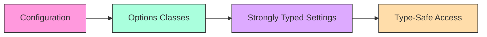
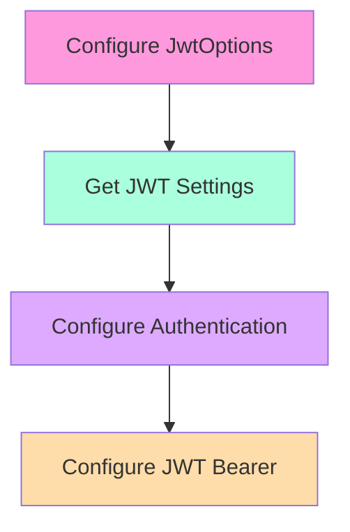
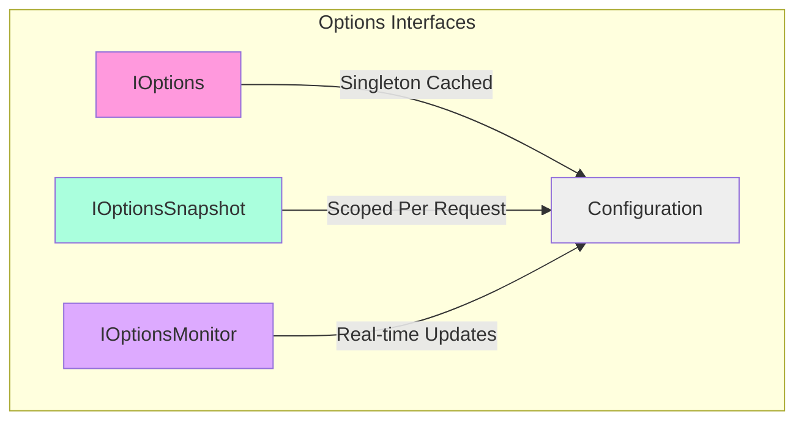
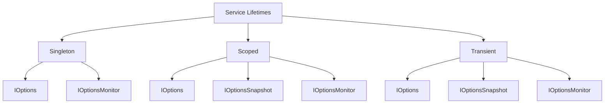
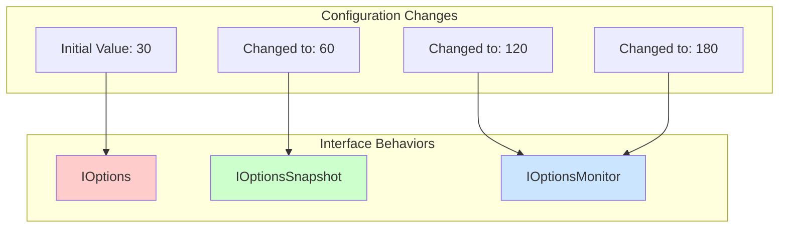
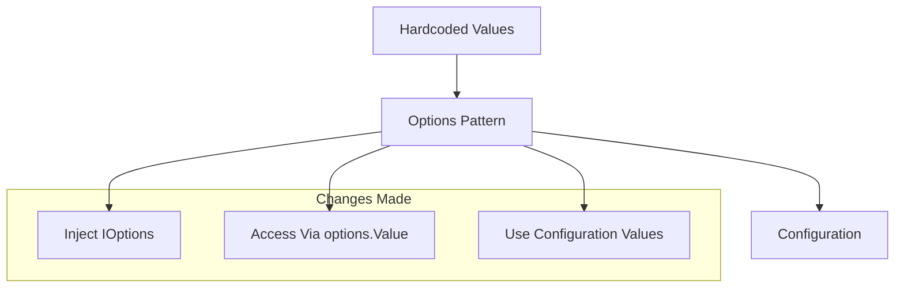
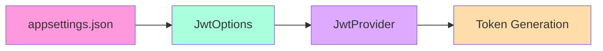

# Options Pattern in .NET

## Overview
The Options Pattern provides a mechanism for creating strongly-typed access to groups of related settings, eliminating "magic strings" and improving type safety in configuration management.



## Key Benefits

| Benefit | Description |
|---------|-------------|
| Type Safety | Compile-time checking of configuration access |
| Encapsulation | Settings grouped by functionality |
| Separation of Concerns | Each configuration group isolated in its own class |
| IntelliSense Support | IDE assistance for property access |

## Options Class Rules

1. **Class Requirements**
   - Must not be abstract
   - Must have public properties
   - Properties must be read/write
   - Property types must match configuration values

2. **Example Configuration**
   ```json
   {
     "Jwt": {
       "Key": "",
       "Issuer": "SurveyBasketApp",
       "Audience": "SurveyBasketApp users",
       "ExpiryMinutes": 30
     }
   }
   ```

3. **Corresponding Options Class**
   ```csharp
   public class JwtOptions
   {
       public string Key { get; set; } = string.Empty;
       public string Issuer { get; set; } = string.Empty;
       public string Audience { get; set; } = string.Empty;
       public int ExpiryMinutes { get; set; }
   }
   ```

## Before vs After Options Pattern

### Before (Using Direct Configuration)
```csharp
public class Service
{
    private readonly IConfiguration _configuration;
    
    public Service(IConfiguration configuration)
    {
        _configuration = configuration;
    }

    public void DoSomething()
    {
        // Magic strings - prone to errors
        var issuer = _configuration["Jwt:Issuer"];
        var expiryMinutes = int.Parse(_configuration["Jwt:ExpiryMinutes"]);
    }
}
```

### After (Using Options Pattern)
```csharp
public class Service
{
    private readonly JwtOptions _jwtOptions;
    
    public Service(IOptions<JwtOptions> jwtOptions)
    {
        _jwtOptions = jwtOptions.Value;
    }

    public void DoSomething()
    {
        // Strongly typed access
        var issuer = _jwtOptions.Issuer;
        var expiryMinutes = _jwtOptions.ExpiryMinutes;
    }
}
```

## Common Use Cases

| Scenario | Example Settings |
|----------|-----------------|
| Authentication | JWT Configuration |
| Email Service | SMTP Settings |
| Logging | Log Levels and Paths |
| API Clients | Endpoints and Timeouts |

## Benefits of Options Pattern

1. **Type Safety**
   - Compile-time error checking
   - No magic strings
   - Proper type conversion

2. **Organization**
   - Logically grouped settings
   - Clear separation of concerns
   - Better maintainability

3. **Development Experience**
   - IntelliSense support
   - Easier refactoring
   - Better discoverability

## Best Practices

1. **Naming Conventions**
   - Suffix classes with "Options"
   - Match configuration section names
   - Use meaningful property names

2. **Validation**
   - Add data annotations
   - Implement validation logic
   - Handle missing values gracefully

3. **Documentation**
   - Document required settings
   - Provide example configurations
   - Explain validation rules

## Implementation Steps

1. **Create Options Class**
   - Define properties matching configuration
   - Add appropriate data types
   - Include any necessary validation

2. **Register with DI**
   - Configure in Program.cs/Startup.cs
   - Bind to configuration section
   - Set lifetime scope

3. **Inject and Use**
   - Inject IOptions<T> in constructors
   - Access typed configuration
   - Use in services/controllers

---

The Options Pattern is a powerful feature in .NET that promotes clean, maintainable, and type-safe configuration access. It's particularly useful for large applications with multiple configuration groups.


# Implementing the Options Pattern with JWT Configuration

## Setting Up the Options Class

### JwtOptions Class
```csharp
public class JwtOptions
{
    public static string SectionName = "Jwt";  // For configuration binding

    public string Key { get; set; } = string.Empty;
    public string Issuer { get; set; } = string.Empty;
    public string Audience { get; set; } = string.Empty;
    public int ExpiryMinutes { get; set; }
}
```

## Configuration in appsettings.json
```json
{
  "Jwt": {
    "Key": "",
    "Issuer": "SurveyBasketApp",
    "Audience": "SurveyBasketApp users",
    "ExpiryMinutes": 30
  }
}
```

## Registering Options with Dependency Injection

### Methods for Section Name Definition
1. **Using Static Property**
   ```csharp
   services.Configure<JwtOptions>(
       configuration.GetSection(JwtOptions.SectionName));
   ```

2. **Using Class Name (Alternative)**
   ```csharp
   services.Configure<JwtOptions>(
       configuration.GetSection(nameof(JwtOptions)));
   ```

### Complete Authentication Configuration
```csharp
private static IServiceCollection AddAuthConfig(
    this IServiceCollection services,
    IConfiguration configuration)
{
    // Register JWT Options
    services.Configure<JwtOptions>(
        configuration.GetSection(JwtOptions.SectionName));

    // Register other services
    services.AddSingleton<IJwtProvider, JwtProvider>();
    
    services.AddIdentity<ApplicationUser, IdentityRole>()
            .AddEntityFrameworkStores<ApplicationDbContext>();

    services.AddAuthentication(options => 
    {
        options.DefaultAuthenticateScheme = 
            JwtBearerDefaults.AuthenticationScheme;
        options.DefaultChallengeScheme = 
            JwtBearerDefaults.AuthenticationScheme;
    })
    .AddJwtBearer(o =>
    {
        o.SaveToken = true;
        o.TokenValidationParameters = new TokenValidationParameters
        {
            ValidateIssuerSigningKey = true,
            ValidateIssuer = true,
            ValidateAudience = true,
            ValidateLifetime = true,
            IssuerSigningKey = new SymmetricSecurityKey(
                Encoding.UTF8.GetBytes(configuration["Jwt:Key"]!)),
            ValidIssuer = configuration["Jwt:Issuer"],
            ValidAudience = configuration["Jwt:Audience"]
        };
    });

    return services;
}
```

## Using Options in Controllers

```csharp
public class AuthController : ControllerBase
{
    private readonly JwtOptions _jwtOptions;

    public AuthController(IOptions<JwtOptions> jwtOptions)
    {
        _jwtOptions = jwtOptions.Value;
    }

    [HttpGet("Test")]
    public IActionResult Test()
    {
        return Ok(_jwtOptions.Audience);
    }
}
```

## Configuration Flow


## Implementation Steps

1. **Create Options Class**
   - Define properties matching configuration section
   - Add static SectionName property
   - Ensure property types match configuration values

2. **Register with Services**
   - Use `Configure<T>` method
   - Specify correct configuration section
   - Add before using the options

3. **Inject and Use**
   - Inject `IOptions<JwtOptions>`
   - Access through `.Value` property
   - Use strongly-typed properties

## Best Practices

| Practice | Description |
|----------|-------------|
| Section Naming | Use consistent naming between JSON and code |
| Static Section Name | Define section name in options class |
| Property Types | Match configuration value types exactly |
| Validation | Add data annotations if needed |

## Common Pitfalls to Avoid

1. **Configuration Binding**
   - Ensure section names match exactly
   - Register options before using them
   - Check property name casing

2. **Dependency Injection**
   - Always use IOptions<T> in constructors
   - Don't forget to call Configure<T>
   - Register in correct order

3. **Type Matching**
   - Ensure property types match JSON values
   - Handle nullable properties appropriately
   - Consider type conversion needs

---

The Options Pattern requires proper setup in both the configuration and dependency injection to work correctly. The key step is registering the options with the correct configuration section using `Configure<T>`.


# Using JWT Options in Dependency Injection Configuration

## Implementation Overview



## Complete Implementation

```csharp
private static IServiceCollection AddAuthConfig(
    this IServiceCollection services,
    IConfiguration configuration)
{
    // Step 1: Add Identity
    services.AddIdentity<ApplicationUser, IdentityRole>()
            .AddEntityFrameworkStores<ApplicationDbContext>();

    // Step 2: Register JWT Provider
    services.AddSingleton<IJwtProvider, JwtProvider>();

    // Step 3: Configure Options Pattern
    services.Configure<JwtOptions>(
        configuration.GetSection(JwtOptions.SectionName));

    // Step 4: Get JWT Settings for immediate use
    var jwtSettings = configuration
        .GetSection(JwtOptions.SectionName)
        .Get<JwtOptions>();

    // Step 5: Configure Authentication with JWT Bearer
    services.AddAuthentication(options => 
    {
        options.DefaultAuthenticateScheme = 
            JwtBearerDefaults.AuthenticationScheme;
        options.DefaultChallengeScheme = 
            JwtBearerDefaults.AuthenticationScheme;
    })
    .AddJwtBearer(o =>
    {
        o.SaveToken = true;
        o.TokenValidationParameters = new TokenValidationParameters
        {
            ValidateIssuerSigningKey = true,
            ValidateIssuer = true,
            ValidateAudience = true,
            ValidateLifetime = true,
            IssuerSigningKey = new SymmetricSecurityKey(
                Encoding.UTF8.GetBytes(jwtSettings?.Key!)),
            ValidIssuer = jwtSettings?.Issuer,
            ValidAudience = jwtSettings?.Audience
        };
    });

    return services;
}
```

## Key Steps Breakdown

| Step | Purpose | Code |
|------|---------|------|
| Configure Options | Register options with DI | `services.Configure<JwtOptions>(...)` |
| Get Settings | Immediate access to values | `configuration.GetSection(...).Get<JwtOptions>()` |
| Use Settings | Configure JWT parameters | `jwtSettings?.Key`, `jwtSettings?.Issuer`, etc. |

## Different Approaches to Access Options

### 1. Immediate Configuration Access
```csharp
var jwtSettings = configuration
    .GetSection(JwtOptions.SectionName)
    .Get<JwtOptions>();
```

### 2. Dependency Injection (For Services/Controllers)
```csharp
private readonly JwtOptions _jwtOptions;

public MyClass(IOptions<JwtOptions> options)
{
    _jwtOptions = options.Value;
}
```

## Best Practices

1. **Null Checking**
   - Use null conditional operator (`?.`) when accessing settings
   - Provide default values where appropriate
   - Validate settings during startup

2. **Configuration Order**
   ```csharp
   // Correct Order
   services.Configure<JwtOptions>(...);  // First configure
   var settings = configuration.Get<JwtOptions>();  // Then get
   ```

3. **Error Handling**
   - Check for null settings
   - Validate required values
   - Handle missing configuration gracefully

## Common Patterns

### Configuration Validation
```csharp
if (jwtSettings?.Key is null)
{
    throw new InvalidOperationException("JWT Key is not configured");
}
```

### Default Values
```csharp
ValidIssuer = jwtSettings?.Issuer ?? "DefaultIssuer",
ValidAudience = jwtSettings?.Audience ?? "DefaultAudience"
```

## Security Considerations

| Consideration | Recommendation |
|---------------|----------------|
| Key Storage | Use secrets.json or environment variables |
| Validation | Always validate settings at startup |
| Defaults | Avoid hardcoding sensitive defaults |

## Configuration Flow

1. **Registration**
   - Register options with services
   - Configure section binding
   - Set up DI container

2. **Access**
   - Get configuration section
   - Convert to strongly-typed object
   - Use in authentication setup

3. **Usage**
   - Configure JWT parameters
   - Set up authentication
   - Apply settings

---

Remember: When using the Options Pattern within dependency injection configuration, you might need both immediate access to values (using `Get<T>`) and dependency injection setup (using `Configure<T>`) for different parts of your application.


# Options Pattern Interfaces in ASP.NET Core

## Interface Overview



## Comparison Table

| Interface | Lifetime | Update Behavior | Service Compatibility | Use Case |
|-----------|----------|-----------------|----------------------|-----------|
| `IOptions<T>` | Singleton | Once at startup | All services | Static configuration |
| `IOptionsSnapshot<T>` | Scoped | Per request | Scoped, Transient | Request-specific config |
| `IOptionsMonitor<T>` | Singleton | Real-time | All services | Dynamic configuration |

## Detailed Interface Descriptions

### 1. IOptions<TOptions>
```csharp
public class MyService
{
    private readonly TOptions _options;

    public MyService(IOptions<TOptions> options)
    {
        _options = options.Value;
    }
}
```

**Characteristics:**
- ✅ Most commonly used (99.99% cases)
- ✅ Singleton registration
- ✅ Can be used with any service lifetime
- ❌ No configuration reloading
- ✅ Best performance (single read)

### 2. IOptionsSnapshot<TOptions>
```csharp
public class MyService
{
    private readonly TOptions _options;

    public MyService(IOptionsSnapshot<TOptions> options)
    {
        _options = options.Value;
    }
}
```

**Characteristics:**
- ✅ Reloads configuration per request
- ✅ Scoped registration
- ✅ Works with scoped and transient services
- ❌ Cannot be used with singleton services
- ✅ Consistent within a request

### 3. IOptionsMonitor<TOptions>
```csharp
public class MyService
{
    private readonly TOptions _options;

    public MyService(IOptionsMonitor<TOptions> options)
    {
        _options = options.CurrentValue;
        options.OnChange(changedOptions =>
        {
            // Handle configuration changes
        });
    }
}
```

**Characteristics:**
- ✅ Real-time configuration updates
- ✅ Singleton registration
- ✅ Can be used with any service lifetime
- ✅ Supports change notifications
- ✅ Best for dynamic configurations

## Service Lifetime Compatibility



## Best Practices

### When to Use Each Interface

| Scenario | Recommended Interface | Reason |
|----------|---------------------|---------|
| Static Configuration | IOptions | Best performance, simplest usage |
| Per-Request Settings | IOptionsSnapshot | Consistent within request |
| Dynamic Updates | IOptionsMonitor | Real-time configuration changes |

### Usage Guidelines

1. **IOptions<T>**
   - Default choice for most scenarios
   - Use when configuration is static
   - Best performance option

2. **IOptionsSnapshot<T>**
   - Use when values might change between requests
   - Good for request-scoped configuration
   - Avoid in singleton services

3. **IOptionsMonitor<T>**
   - Use when real-time updates are needed
   - Good for long-running services
   - Use when monitoring configuration changes

## Implementation Examples

### Static Configuration
```csharp
public class StaticConfigService
{
    private readonly MyOptions _options;

    public StaticConfigService(IOptions<MyOptions> options)
    {
        _options = options.Value;
    }
}
```

### Request-Scoped Configuration
```csharp
public class RequestScopedService
{
    private readonly MyOptions _options;

    public RequestScopedService(IOptionsSnapshot<MyOptions> options)
    {
        _options = options.Value;
    }
}
```

### Dynamic Configuration
```csharp
public class DynamicConfigService
{
    private MyOptions _options;

    public DynamicConfigService(IOptionsMonitor<MyOptions> options)
    {
        _options = options.CurrentValue;
        options.OnChange(changed =>
        {
            _options = changed;
            OnConfigurationChanged();
        });
    }
}
```

---

Remember to choose the appropriate interface based on your specific needs regarding configuration updates and service lifetime requirements.


# Options Pattern Interfaces - Practical Implementation Examples

## Controller Implementation

```csharp
[Route("[controller]")]
[ApiController]
public class AuthController : ControllerBase
{
    private readonly IAuthService _authService;
    private readonly IOptions<JwtOptions> _options;
    private readonly IOptionsSnapshot<JwtOptions> _snapshotOptions;
    private readonly IOptionsMonitor<JwtOptions> _monitorOptions;

    public AuthController(
        IAuthService authService,
        IOptions<JwtOptions> options,
        IOptionsSnapshot<JwtOptions> snapshotOptions,
        IOptionsMonitor<JwtOptions> monitorOptions)
    {
        _authService = authService;
        _options = options;
        _snapshotOptions = snapshotOptions;
        _monitorOptions = monitorOptions;
    }

    [HttpGet("Test")]
    public IActionResult Test()
    {
        var values = new
        {
            iOptionsValue = _options.Value.ExpiryMinutes,
            iOptionsSnapShotValue = _snapshotOptions.Value.ExpiryMinutes,
            iOptionsMonitorValue = _monitorOptions.CurrentValue.ExpiryMinutes
        };

        // Simulate delay to allow configuration changes
        Thread.Sleep(5000);

        var values2 = new
        {
            iOptionsValue = _options.Value.ExpiryMinutes,
            iOptionsSnapShotValue = _snapshotOptions.Value.ExpiryMinutes,
            iOptionsMonitorValue = _monitorOptions.CurrentValue.ExpiryMinutes
        };

        return Ok(new { values, values2 });
    }
}
```

## Behavior Analysis

### Scenario 1: No Configuration Changes
```json
{
    "values": {
        "iOptionsValue": 30,
        "iOptionsSnapShotValue": 30,
        "iOptionsMonitorValue": 30
    },
    "values2": {
        "iOptionsValue": 30,
        "iOptionsSnapShotValue": 30,
        "iOptionsMonitorValue": 30
    }
}
```

### Scenario 2: Value Changed to 60
```json
{
    "values": {
        "iOptionsValue": 30,        // Remains unchanged without restart
        "iOptionsSnapShotValue": 60, // Updated with new request
        "iOptionsMonitorValue": 60   // Updated with change
    },
    "values2": {
        "iOptionsValue": 30,
        "iOptionsSnapShotValue": 60,
        "iOptionsMonitorValue": 60
    }
}
```

### Scenario 3: Mid-Request Change (120 → 180)
```json
{
    "values": {
        "iOptionsValue": 30,         // Still unchanged
        "iOptionsSnapShotValue": 120, // Value at request start
        "iOptionsMonitorValue": 120   // Initial value
    },
    "values2": {
        "iOptionsValue": 30,         // Requires restart
        "iOptionsSnapShotValue": 120, // Same throughout request
        "iOptionsMonitorValue": 180   // Updated mid-request
    }
}
```

## Behavior Comparison



## Interface Characteristics

| Interface | Update Trigger | Value Changes | Use Case |
|-----------|----------------|---------------|-----------|
| `IOptions` | Application restart | Never during runtime | Static configuration |
| `IOptionsSnapshot` | New request | Per request | Request-scoped changes |
| `IOptionsMonitor` | Real-time | Immediate, even mid-request | Dynamic configuration |

## Key Observations

1. **IOptions<T>**
   - Values remain constant during runtime
   - Requires application restart to reflect changes
   - Most memory-efficient for static configuration

2. **IOptionsSnapshot<T>**
   - Updates values with each new request
   - Maintains consistent values within a single request
   - Good for request-level configuration

3. **IOptionsMonitor<T>**
   - Detects changes in real-time
   - Can update values during request execution
   - Best for dynamic configuration requirements

## Best Practices

1. **Choose Based on Requirements**
   - Use `IOptions` for static values (most common)
   - Use `IOptionsSnapshot` for per-request consistency
   - Use `IOptionsMonitor` for real-time updates

2. **Performance Considerations**
   - `IOptions` has lowest overhead
   - `IOptionsSnapshot` creates new instance per request
   - `IOptionsMonitor` maintains change tracking

3. **Testing Scenarios**
   - Consider adding delays to test dynamic updates
   - Verify behavior across multiple requests
   - Test mid-request configuration changes

---

Remember: For most applications, `IOptions<T>` is sufficient. Only use `IOptionsSnapshot` or `IOptionsMonitor` when you specifically need their dynamic update capabilities.


# Implementing Options Pattern in JWT Provider

## Controller Implementation
```csharp
[Route("[controller]")]
[ApiController]
public class AuthController : ControllerBase
{
    private readonly IAuthService _authService;

    public AuthController(IAuthService authService)
    {
        _authService = authService;
    }

    [HttpPost("")]
    public async Task<IActionResult> LoginAsync(
        LoginRequest request, 
        CancellationToken cancellationToken)
    {
        var authResult = await _authService.GetTokenAsync(
            request.Email,
            request.password,
            cancellationToken);

        return authResult is null 
            ? BadRequest("Invalid email or password")
            : Ok(authResult);
    }
}
```

## JWT Provider Evolution

### Before (Hardcoded Values)
```csharp
public class JwtProvider : IJwtProvider
{
    private readonly IOptions<JwtOptions> _options;

    public JwtProvider(IOptions<JwtOptions> options)
    {
        _options = options;
    }

    public (string token, int expiresIn) GenerateToken(ApplicationUser user)
    {
        var claims = new[]
        {
            new Claim(JwtRegisteredClaimNames.Sub, user.Id),
            new Claim(JwtRegisteredClaimNames.Email, user.Email!),
            new Claim(JwtRegisteredClaimNames.GivenName, user.FirstName),
            new Claim(JwtRegisteredClaimNames.FamilyName, user.LastName),
            new Claim(JwtRegisteredClaimNames.Jti, Guid.NewGuid().ToString())
        };

        var symmetricSecurityKey = new SymmetricSecurityKey(
            Encoding.UTF8.GetBytes("J7MfAb4WcAIMkkigVtIepIILOVJEjAcB"));

        var signingCredentials = new SigningCredentials(
            symmetricSecurityKey, 
            SecurityAlgorithms.HmacSha256);

        var token = new JwtSecurityToken(
            issuer: "SurveyBasketApp",
            audience: "SurveyBasket users",
            claims: claims,
            expires: DateTime.UtcNow.AddMinutes(expiresIn),
            signingCredentials: signingCredentials);

        return (
            token: new JwtSecurityTokenHandler().WriteToken(token),
            expiresIn: expiresIn * 60);
    }
}
```

### After (Using Options Pattern)
```csharp
public class JwtProvider : IJwtProvider
{
    private readonly JwtOptions _options;

    public JwtProvider(IOptions<JwtOptions> options)
    {
        _options = options.Value;
    }

    public (string token, int expiresIn) GenerateToken(ApplicationUser user)
    {
        var claims = new[]
        {
            new Claim(JwtRegisteredClaimNames.Sub, user.Id),
            new Claim(JwtRegisteredClaimNames.Email, user.Email!),
            new Claim(JwtRegisteredClaimNames.GivenName, user.FirstName),
            new Claim(JwtRegisteredClaimNames.FamilyName, user.LastName),
            new Claim(JwtRegisteredClaimNames.Jti, Guid.NewGuid().ToString())
        };

        var symmetricSecurityKey = new SymmetricSecurityKey(
            Encoding.UTF8.GetBytes(_options.Key));

        var signingCredentials = new SigningCredentials(
            symmetricSecurityKey, 
            SecurityAlgorithms.HmacSha256);

        var token = new JwtSecurityToken(
            issuer: _options.Issuer,
            audience: _options.Audience,
            claims: claims,
            expires: DateTime.UtcNow.AddMinutes(_options.ExpiryMinutes),
            signingCredentials: signingCredentials);

        return (
            token: new JwtSecurityTokenHandler().WriteToken(token),
            expiresIn: _options.ExpiryMinutes * 60);
    }
}
```

## Key Changes



## Implementation Benefits

| Aspect | Before | After |
|--------|---------|--------|
| Configuration | Hardcoded | External |
| Maintainability | Low | High |
| Security | Less Secure | More Secure |
| Flexibility | Static | Dynamic |

## Best Practices

1. **Options Access**
   - Store options.Value in private readonly field
   - Access once during construction
   - Use strongly typed properties

2. **Security**
   - Keep sensitive data in user secrets/environment variables
   - Never hardcode security keys
   - Use configuration for all JWT parameters

3. **Implementation**
   - Use dependency injection
   - Validate options at startup
   - Handle missing values gracefully

## Validation Checks

```csharp
public JwtProvider(IOptions<JwtOptions> options)
{
    _options = options.Value ?? throw new ArgumentNullException(nameof(options));
    
    if (string.IsNullOrEmpty(_options.Key))
        throw new InvalidOperationException("JWT Key is not configured");
}
```

## Configuration Flow



---

The implementation shows how to move from hardcoded values to a configuration-based approach using the Options Pattern, improving security and maintainability.
